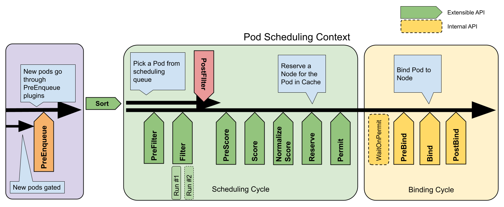

# kube-scheduler 前置知识

## 何为调度？
k8s 中的调度指的是为pod绑定node的过程。

涉及到两个阶段：预选，优选。
预选阶段过滤掉不符合硬性要求到节点（如资源量，资源冲突等）；优选阶段选择得分最高的节点，如何评定分数就涉及到各种策略。

## 调度框架

调度框架定义了一些扩展点。调度器插件注册后在一个或多个扩展点处被调用。 这些插件中的一些可以改变调度决策，而另一些仅用于提供信息。

每次调度一个 Pod 的尝试都分为两个阶段，即调度周期和绑定周期。

调度周期和绑定周期
调度周期为 Pod 选择一个节点，绑定周期将该决策应用于集群。 调度周期和绑定周期一起被称为“调度上下文”。

调度周期是串行运行的，而绑定周期可能是同时运行的。

如果确定 Pod 不可调度或者存在内部错误，则可以终止调度周期或绑定周期。 Pod 将返回队列并重试。

## 扩展点
* PreEnqueue
* EnqueueExtension
* QueueingHint
* PreFilter
* Filter
* PostFilter
* PreScore
* Score
* NormalizeScore
* Reserve
* Permit
* PreBind
* Bind
* PostBind

## 参考
[官方文档](https://kubernetes.io/docs/concepts/scheduling-eviction/)